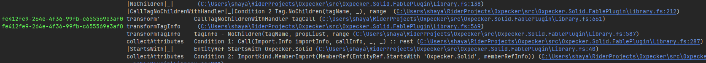

# Fable.Plugin.Tracer

A single file helper for Fable plugin developers or maintainers to improve diagnostics when investigating AST transformations.

## Example

An example output from a trace with no depth limit in combination with just one of the emissions presented in JSON form are included in the examples folder.

## API

The namespace includes a static `Settings` class that maintains the runtime information when compiling with Fable.

Your plugin entry point, such as within a `MemberDeclarationPluginAttribute`, passes the plugin helper from Fable.

```fsharp
open Fable.Plugin.Tracer // or whatever you decide to name the file

type SomeComponentAttribute() =
    inherit MemberDeclarationPluginAttribute()
    override _.FableMinimumVersion = "4.0"
    override this.Transform(pluginHelper, file, memberDecl) =
        Settings.configure "MYPLUGIN" pluginHelper
        // ... // plugin logic
```

`Settings.configure` takes two arguments, the string that will be prefixed to all the generated Compiler Defines, and the Fable PluginHelper.

My motivation for this was to help me understand the flow of operations when working on the plugin. But this doesn't mean that it should bloat your compilation. There are unnecessary cycles due to the lack of real conditional compilation when using Fable, but since this won't impact the output, it's a non issue to me.

The point is, that there is no altered behaviour unless you pass Compiler Define flags. These flags will all be prefixed with the string passed to the `Settings.configure`.

---

### Compiler Directives

> For these examples, I use an example configuration with `Partas` as the supplied string.
> Compiler flags in Fable are generally all caps, and the generated defines follow the same format, so you should do the same.
> Instead of `Partas`, I use `PARTAS`

* `PARTAS_MINIMAL`

Outputs the source code locations of traces and associated messages only

* `PARTAS_DEBUG`

Outputs the source code locations, and the JSON of any associated values embedded in tracers up to a max depth of 4 by default.

> The depth can be modified by appending an additional integer to the command, ie: `PARTAS_DEBUG_13` will prove JSON to a max depth of 13.

* `PARTAS_TRACE`

Same as `_DEBUG` but without a depth limit

* `PARTAS_FILE`

Pipes output to a txt file in the cwd. The name of the file cannot be modified with the current API.
If the current configuration will print JSON, the JSON will not present on stdout, and will be piped to the file. However, the trace/source locations will still print to stdout.

---

## API - Continued

JSON has plenty of viewers and formatters to work with. And it's also the best format to eventually 
view with a JS framework/component library once I get around to it. For this reason, I made a JSON converter that outputs helpful readable JSON in the context of the FABLE AST. All the FABLE AST Unions have named fields, and it's not helpful distinguishing between different nodes within a union type when the union name is in an array with the object. Instead, I embed the name of the union type/node into the value itself (when the union case has more than one field, otherwise it does a key,value pair, or the union case directly if there are no fields).

The library already has all the Fable AST unions you'd be using in plugin development registered with converters.

To register your own unions, add them to the registry at the bottom of the JsonConverters module:

```fsharp
register<Fable.Expr> // just as example; this is already registered by the library
register<MyUnion>
register<SomeOtherUnion>
```

You can change the JSON converter to match your own flavour. It's pretty self explanatory.

### Tracers

The library implements a simple record container for any type:

```fsharp
type Tracer<'T> =
    {
        Value: 'T
        Guid: System.Guid
        ConsoleColor: System.ConsoleColor
    }
```

If a single root element of your AST has multiple expression transformations on branching child expressions, then you might want to trace them all as a collection, or perhaps only have particular ones be identified uniquely. This will dictate when you want your transformations to operate off Tracers rather than the raw values.

To create a tracer:

```fsharp
let transform (myObj: Fable.Expr) =
    let tracer = Tracer.create myObj
    // ... // perform transformations etc
```

Tracers, when directed, can output/emit/trace. When this is performed from tracers, it will uniquely identify the source by their GUID and a randomised color for that GUID:


If you want to create a tracer that has the same GUID/color as another, then you are effectively binding a different value to the tracer.

```fsharp
let transform(myObj: Fable.Expr) =
    let tracer = Tracer.create myObj
    // ... // perform transformations
    let someChildAstInfo: Fable.Type = ...
    someChildAstInfo
    |> Tracer.bind tracer
    |> // ...  // perform further transformations
```

If you want to perform some function on the internal value, you can use map

```fsharp
let transform(myObj: Fable.Expr) =
    let tracer = Tracer.create myObj
    tracer // Tracer<Fable.Expr>
    |> Tracer.map _.Guid // Tracer<Guid>
    |> Tracer.map _.ToString() // Tracer<string>
    |> ignore
    [ Expr(), Expr(), ...]
    |> Tracer.create // Tracer<Fable.Expr list>
    |> Tracer.map (List.map (fun _ -> ...))
```

### Tracing

When you want to actually emit the expression as part of a trace or for diagnostics, you have several options.

You have two methods that are performed directly on the `Tracer` object as described by the following pseudo code definitions:

* `this.trace(?message: string): this`
* `this.ping(?message: string): unit`

The message trace message will be a colorized GUID, followed by the **member name** of its call location, followed by the *optional message*, followed by the **source location** of the emission.

The problem is that unless you strictly use custom active recognisers, you will eventually default to using pattern matching which we cannot automatically acquire the name of at runtime (afaik). This is where I find the optional message useful. Here's an example of some memberNames in combination with optional messages used to help me grok the flow of operations in the `Oxpecker.Solid.FablePlugin` library:



I'll almost always add an emission for every different (+) pattern match so that I don't have to purely rely on the source locations to differentiate between them.

The source locations are interactable with compatible consoles/IDEs. I use Jetbrains Rider for F#.

You'll notice that there are emissions there that are not associated with any GUIDs. These are just generic emissions that are not associated with, nor generate any value diagnostics (no json is printed since there is no value associated to print).

* `Tracer.ping(?message: string): unit`

# Motivation

I found this extremely useful when I was grokking the Oxpecker.Solid.FablePlugin. It's super simple and just provides a good default platform for customising diagnostics in plugin development. Can help because a user filing an issue can provide a file with the trace that contains the problem AST transformations.

Since I'm not the author, I had no idea where to begin. It was my first time working with Fable Plugins, and the F#/Fable AST.

There was no easily foldable and universal string version I could use while trying to understand what was happening. Also, how do I know when a print occurs if it occured on the specific expression in the plugin that is causing the issue? How would I follow that?

You can see my implementation of this tracer in the [`Oxpecker.Solid.FablePlugin` pull I made](https://github.com/Lanayx/Oxpecker/pull/55)

Perhaps I'm an over-glorified, over-evolved excuse for a potato clock, but I found this useful, and I hope someone else does too. Or I hope someone else points me to a library which does exactly this but 100x better that I somehow didn't find with my searches on GitHub or Fable.io so I can summarily **~~redacted~~** myself.

I'm a blunt sharpie.

# Installation

This isn't a nuget library or something. It's a single file you can plop into any project to use as you see fit.

Go nuts.
